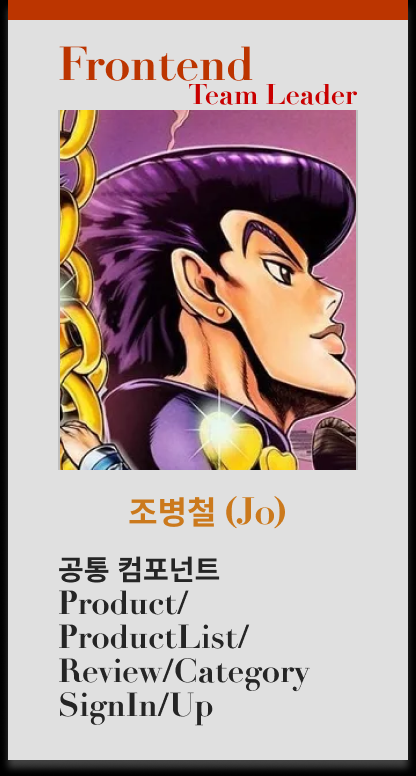
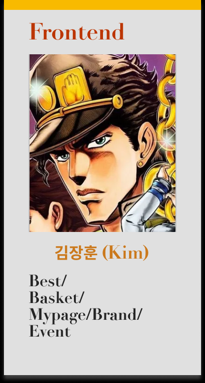
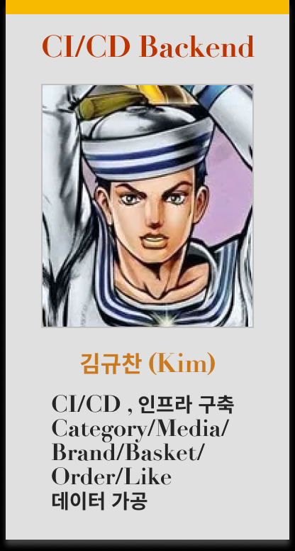
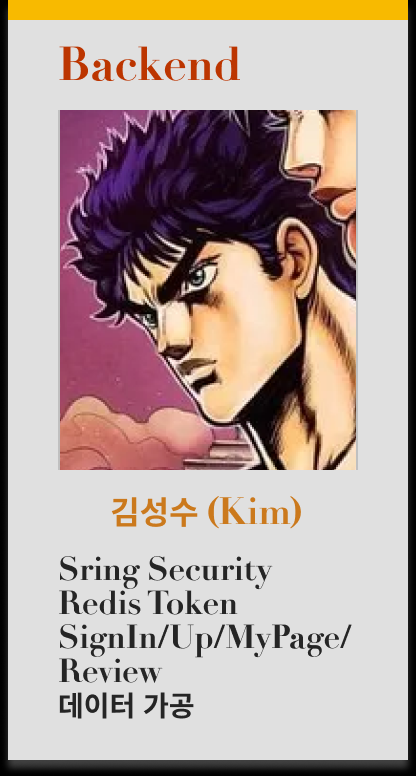
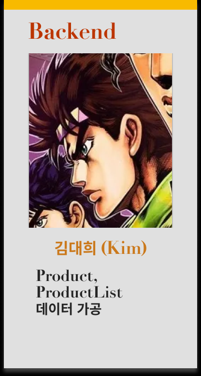
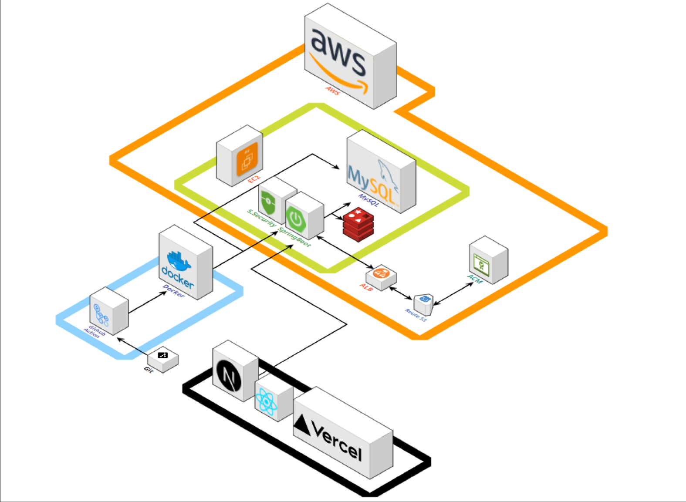
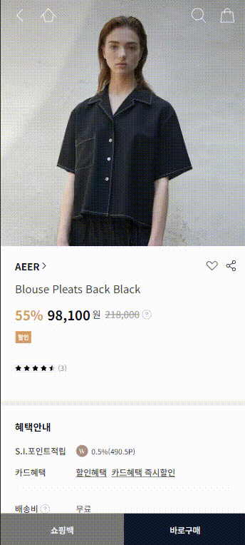
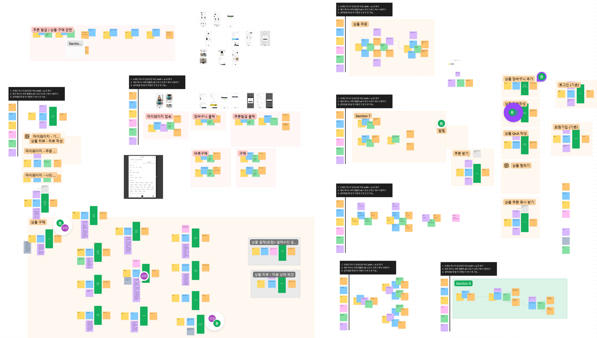
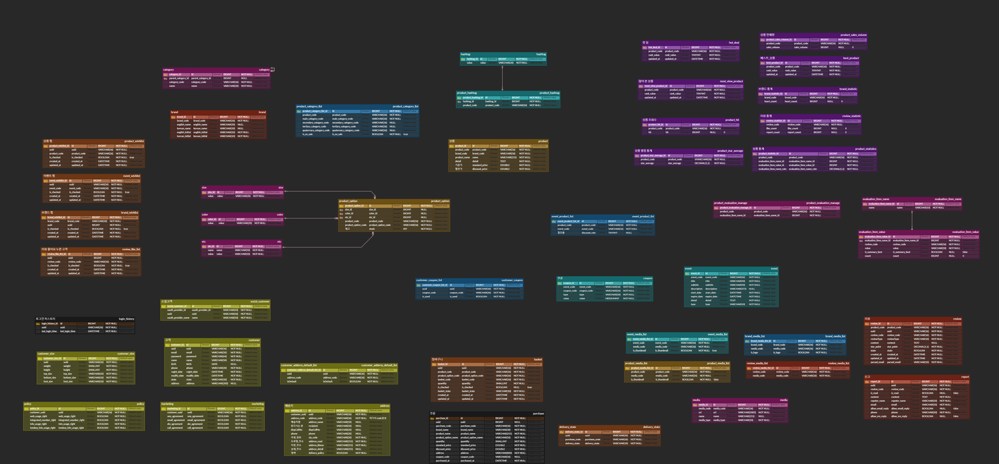

# 🛒 S.I.VILLAGE
신세계 인터내셔날 공식몰 S.I.VILLAGE 리빌딩 프로젝트 <br>
100만 명 이상의 사용자에게 대용량 데이터를 효율적으로 제공할 수 있는 시스템 설계를 목표로 S.I.VILAGE 스토어를 리빌딩합니다.

- **개발 기간** : 2024.08.06 ~ 2024.09.30 (7주)
- **플랫폼** : Web
- **개발 인원** : 5명 <br><br>

<table align="center">
  <tbody align="center"> 
    <tr>
      <td align="center" valign="middle" width="50%">
        
      </td>
      <td align="center" valign="middle" width="50%">
        <div style="display: inline-block; text-align: center;">
           <br><br>
          
        </div>
      </td>
    </tr>
  </tbody>
</table> <br>


## 🔎 목차
<div align="center">

### <a href="#developers">🌟 팀원 구성</a>
### <a href="#techStack">🛠️ 기술 스택</a>
### <a href="#systemArchitecture">🌐 시스템 아키텍처</a>
### <a href="#skills">📲 기능 구성</a>
### <a href="#directories">📂 디렉터리 구조</a>
### <a href="#projectDeliverables">📦 프로젝트 산출물</a>
</div>
<br>

## 🌟 팀원 구성
<a name="developers"></a>
<div align="center">
<table>
    <tr>
        <td height="320px" align="center"> <a href="https://github.com/bbang7">
             <br> 🌞 조병철 <br>(Frontend) </a> <br></td>
        <td height="320px" align="center"> <a href="https://github.com/jangdebug">
             <br> 🐱 김장훈 <br>(Frontend) </a> <br></td>
        <td height="320px" align="center"> <a href="https://github.com/gyudol">
             <br> 🐹 김규찬 <br>(Backend & DevOps) </a> <br></td>
        <td height="320px" align="center"> <a href="https://github.com/aidzero01">
             <br> 😈 김성수 <br>(Backend) </a> <br></td>
        <td height="320px" align="center"> <a href="https://github.com/everydayday">
             <br> 👨🏻‍💻 김대희 <br>(Backend) </a> <br></td>
    </tr>
    <tr>
      <td width="160px">
        <sub>
          공통 컴포넌트, Product, ProductList, Review, Category, 로그인/회원가입 퍼블리싱 및 연동
        </sub>
      </td>
      <td width="160px">
        <sub>
          Best, Brand, Event, 장바구니, 마이페이지 퍼블리싱 및 연동
        </sub>
      </td>
      <td width="160px">
        <sub>
        CI/CD 환경 및 인프라 구축 <br>
        <strong>API</strong>: Category, ProductList, Media, Brand, Wishlist & Like, 장바구니, 주문 <br>
        <strong>데이터 가공</strong>: Category, Brand, Product, Media
        </sub>
      </td>
      <td width="160px">
        <sub>
          Spring Security, JWT <br>
          <strong>API</strong>: Review, Statistics, 로그인/회원가입, 마이페이지 <br>
        <strong>데이터 가공</strong>: Review
        </sub>
        </sub>
      </td>
      <td width="160px">
        <sub>
          <strong>API</strong>: Product, Product Option <br>
        <strong>데이터 가공</strong>: ProductOption
      </td>
    </tr>
</table>
</div>
<br>

## 🛠️ 기술 스택
<a name="techStack"></a>
### Frontend

<div align="center">

<br>


<br>


</div>

- **Language |** TypeScript 5.5.4
- **Runtime Environment |** Node.js 20.16.0
- **Framework |** Next.js 14.2.7, Tailwind CSS 3.4.1
- **Library |** Shadcn UI
- **IDE |** Visual Studio Code 1.93.1
- **Deploy |** Vercel

### Backend
<div align="center">


<br>


<br>


</div>

- **Language |** Java 17, Python 3.12.4
- **Framework |** Spring Boot 3.2.9
- **Library |** Spring Data JPA, Querydsl 5.0.0
- **Database |** MySQL 8.0.38, Redis 7.2
- **IDE |** IntelliJ IDEA 2024.2 (Ultimate Edition), Visual Studio Code 1.93.1
- **Build Tool |** Gradle 8.8.0

### DevOps
<div align="center">


<br>


</div>

### Collaboration
<div align="center">


</div>
<br>

## 🌐 시스템 아키텍처
<a name="systemArchitecture"></a>
<div align="center"> 


</div>
<br>

## 📲 기능 구성
<a name="skills"></a>
<div align="center"> 
<table>
  <tbody align="center"> 
    <tr> <th style="text-align: center"> Main Page </th> <th style="text-align: center"> Sign Up / Sign In </th> <th style="text-align: center"> Brand </th> </tr>
    <tr> <td width="33%"></td> 
    <td width="33%"></td> 
      <td width="33%"></td> </tr>
    <tr> <th style="text-align: center"> Product Detail </th> <th style="text-align: center"> Basket </th> <th style="text-align: center"> Product List Infinite Scroll </th> </tr>
    <tr> <td width="33%"></td> <td width="33%"></td> 
      <td width="33%"></td> </tr>
  </tbody>
</table>
</div>
<br>

## 📂 디렉터리 구조
<a name="directories"></a>
### Frontend
<details align="left">
  <summary>
    자세히
  </summary>

  ```
  📦frontend
 ┣ 📂.husky
 ┣ 📂public
 ┃ ┣ 📂assets
 ┃ ┃ ┗ 📂fonts
 ┣ 📂src
 ┃ ┣ 📂actions
 ┃ ┃ ┣ 📂auth
 ┃ ┃ ┣ 📂basket
 ┃ ┃ ┣ 📂best
 ┃ ┃ ┣ 📂brand
 ┃ ┃ ┣ 📂category
 ┃ ┃ ┣ 📂event
 ┃ ┃ ┣ 📂like
 ┃ ┃ ┣ 📂main
 ┃ ┃ ┣ 📂mypage
 ┃ ┃ ┣ 📂order
 ┃ ┃ ┣ 📂product
 ┃ ┃ ┗ 📂review
 ┃ ┣ 📂app
 ┃ ┃ ┣ 📂(auth)
 ┃ ┃ ┃ ┣ 📂sign-in
 ┃ ┃ ┃ ┃ ┣ 📂find-account
 ┃ ┃ ┃ ┃ ┣ 📂find-result
 ┃ ┃ ┃ ┣ 📂sign-up
 ┃ ┃ ┃ ┃ ┣ 📂phone
 ┃ ┃ ┃ ┃ ┣ 📂simple
 ┃ ┃ ┣ 📂(main)
 ┃ ┃ ┃ ┣ 📂best
 ┃ ┃ ┃ ┃ ┣ 📂gift
 ┃ ┃ ┃ ┃ ┣ 📂popular
 ┃ ┃ ┃ ┃ ┣ 📂view
 ┃ ┃ ┃ ┣ 📂event
 ┃ ┃ ┣ 📂api
 ┃ ┃ ┃ ┗ 📂auth
 ┃ ┃ ┃ ┃ ┗ 📂[...nextauth]
 ┃ ┃ ┣ 📂basket
 ┃ ┃ ┃ ┣ 📂regular
 ┃ ┃ ┣ 📂brand
 ┃ ┃ ┃ ┣ 📂favorite
 ┃ ┃ ┣ 📂category
 ┃ ┃ ┣ 📂config
 ┃ ┃ ┣ 📂context
 ┃ ┃ ┣ 📂event-detail
 ┃ ┃ ┃ ┣ 📂[id]
 ┃ ┃ ┃ ┃ ┣ 📂@category
 ┃ ┃ ┃ ┃ ┣ 📂@relation
 ┃ ┃ ┣ 📂mypage
 ┃ ┃ ┃ ┣ 📂beautysize
 ┃ ┃ ┃ ┃ ┣ 📂beauty
 ┃ ┃ ┃ ┣ 📂delivery-info
 ┃ ┃ ┃ ┃ ┣ 📂account
 ┃ ┃ ┃ ┃ ┣ 📂add
 ┃ ┃ ┃ ┃ ┣ 📂modify
 ┃ ┃ ┃ ┣ 📂modPassword
 ┃ ┃ ┃ ┣ 📂order
 ┃ ┃ ┃ ┣ 📂review
 ┃ ┃ ┃ ┃ ┣ 📂products
 ┃ ┃ ┃ ┣ 📂searchwish
 ┃ ┃ ┃ ┃ ┣ 📂events
 ┃ ┃ ┣ 📂order
 ┃ ┃ ┣ 📂product
 ┃ ┃ ┃ ┣ 📂[[...slug]]
 ┃ ┃ ┣ 📂product-detail
 ┃ ┃ ┃ ┣ 📂[id]
 ┃ ┃ ┃ ┃ ┣ 📂@review
 ┃ ┃ ┃ ┃ ┣ 📂@summary
 ┃ ┃ ┣ 📂providers
 ┃ ┃ ┣ 📂reviews
 ┃ ┃ ┃ ┗ 📂[id]
 ┃ ┣ 📂components
 ┃ ┃ ┣ 📂basket
 ┃ ┃ ┣ 📂best
 ┃ ┃ ┣ 📂brand
 ┃ ┃ ┣ 📂category
 ┃ ┃ ┣ 📂dummy
 ┃ ┃ ┣ 📂event
 ┃ ┃ ┃ ┣ 📂detail
 ┃ ┃ ┣ 📂find-account
 ┃ ┃ ┣ 📂icons
 ┃ ┃ ┃ ┣ 📂auth-service-header
 ┃ ┃ ┃ ┣ 📂basket
 ┃ ┃ ┃ ┣ 📂best
 ┃ ┃ ┃ ┣ 📂bottom-navigation
 ┃ ┃ ┃ ┣ 📂brand
 ┃ ┃ ┃ ┣ 📂footer
 ┃ ┃ ┃ ┣ 📂main-header
 ┃ ┃ ┃ ┣ 📂mypage
 ┃ ┃ ┃ ┣ 📂product
 ┃ ┃ ┃ ┣ 📂product-cat-info-header
 ┃ ┃ ┃ ┣ 📂product-detail
 ┃ ┃ ┃ ┣ 📂product-list-header
 ┃ ┃ ┃ ┣ 📂review
 ┃ ┃ ┃ ┣ 📂sign-in
 ┃ ┃ ┃ ┣ 📂sign-up
 ┃ ┃ ┃ ┗ 📂to-top-button
 ┃ ┃ ┣ 📂layout
 ┃ ┃ ┣ 📂main
 ┃ ┃ ┣ 📂mypage
 ┃ ┃ ┃ ┣ 📂myBeautySize
 ┃ ┃ ┃ ┣ 📂myDelivery
 ┃ ┃ ┃ ┃ ┣ 📂addDelivery
 ┃ ┃ ┃ ┃ ┣ 📂modifyDelivery
 ┃ ┃ ┃ ┣ 📂myInfoCategory
 ┃ ┃ ┃ ┣ 📂myInfoLookUp
 ┃ ┃ ┃ ┣ 📂myInfoTop
 ┃ ┃ ┃ ┣ 📂myPassword
 ┃ ┃ ┃ ┣ 📂myReview
 ┃ ┃ ┃ ┣ 📂myWish
 ┃ ┃ ┃ ┣ 📂order
 ┃ ┃ ┣ 📂order
 ┃ ┃ ┣ 📂product
 ┃ ┃ ┣ 📂product-detail
 ┃ ┃ ┣ 📂rank
 ┃ ┃ ┣ 📂review
 ┃ ┃ ┣ 📂sign-in
 ┃ ┃ ┣ 📂sign-up
 ┃ ┃ ┃ ┣ 📂simple
 ┃ ┃ ┃ ┃ ┣ 📂esseitial-form-item
 ┃ ┃ ┃ ┃ ┣ 📂optional-form-item
 ┃ ┃ ┣ 📂ui
 ┃ ┃ ┗ 📂util
 ┃ ┣ 📂datas
 ┃ ┃ ┗ 📂dummy
 ┃ ┃ ┃ ┣ 📂basket
 ┃ ┃ ┃ ┣ 📂best
 ┃ ┃ ┃ ┣ 📂brand
 ┃ ┃ ┃ ┣ 📂category
 ┃ ┃ ┃ ┣ 📂event
 ┃ ┃ ┃ ┣ 📂main
 ┃ ┃ ┃ ┣ 📂mypage
 ┃ ┃ ┃ ┣ 📂order
 ┃ ┃ ┃ ┣ 📂product
 ┃ ┃ ┃ ┣ 📂review
 ┃ ┃ ┃ ┗ 📂sign-up
 ┃ ┣ 📂hooks
 ┃ ┣ 📂lib
 ┃ ┣ 📂types
 ┣ 📜.eslintrc.json
 ┣ 📜.gitignore
 ┣ 📜.prettierignore
 ┣ 📜.prettierrc.json
 ┣ 📜components.json
 ┣ 📜next.config.mjs
 ┣ 📜package-lock.json
 ┣ 📜package.json
 ┣ 📜postcss.config.mjs
 ┣ 📜README.md
 ┣ 📜tailwind.config.ts
 ┗ 📜tsconfig.json
  ```
</details>

### Backend
<details align="left">
  <summary>
    자세히
  </summary>

  ```
  📦backend
 ┣ 📂.github
 ┃ ┣ 📂ISSUE_TEMPLATE
 ┃ ┣ 📂workflows
 ┣ 📂gradle
 ┃ ┗ 📂wrapper
 ┣ 📂src
 ┃ ┣ 📂main
 ┃ ┃ ┗ 📂java
 ┃ ┃ ┃ ┗ 📂com
 ┃ ┃ ┃ ┃ ┗ 📂jokim
 ┃ ┃ ┃ ┃ ┃ ┗ 📂sivillage
 ┃ ┃ ┃ ┃ ┃ ┃ ┣ 📂api
 ┃ ┃ ┃ ┃ ┃ ┃ ┃ ┣ 📂basket
 ┃ ┃ ┃ ┃ ┃ ┃ ┃ ┃ ┣ 📂application
 ┃ ┃ ┃ ┃ ┃ ┃ ┃ ┃ ┣ 📂domain
 ┃ ┃ ┃ ┃ ┃ ┃ ┃ ┃ ┣ 📂dto
 ┃ ┃ ┃ ┃ ┃ ┃ ┃ ┃ ┃ ┣ 📂in
 ┃ ┃ ┃ ┃ ┃ ┃ ┃ ┃ ┃ ┗ 📂out
 ┃ ┃ ┃ ┃ ┃ ┃ ┃ ┃ ┣ 📂infrastructure
 ┃ ┃ ┃ ┃ ┃ ┃ ┃ ┃ ┣ 📂presentation
 ┃ ┃ ┃ ┃ ┃ ┃ ┃ ┃ ┗ 📂vo
 ┃ ┃ ┃ ┃ ┃ ┃ ┃ ┃ ┃ ┣ 📂in
 ┃ ┃ ┃ ┃ ┃ ┃ ┃ ┃ ┃ ┗ 📂out
 ┃ ┃ ┃ ┃ ┃ ┃ ┃ ┣ 📂batch
 ┃ ┃ ┃ ┃ ┃ ┃ ┃ ┃ ┣ 📂domain
 ┃ ┃ ┃ ┃ ┃ ┃ ┃ ┃ ┗ 📂infrastructure
 ┃ ┃ ┃ ┃ ┃ ┃ ┃ ┣ 📂brand
 ┃ ┃ ┃ ┃ ┃ ┃ ┃ ┃ ┣ 📂application
 ┃ ┃ ┃ ┃ ┃ ┃ ┃ ┃ ┣ 📂domain
 ┃ ┃ ┃ ┃ ┃ ┃ ┃ ┃ ┣ 📂dto
 ┃ ┃ ┃ ┃ ┃ ┃ ┃ ┃ ┃ ┣ 📂in
 ┃ ┃ ┃ ┃ ┃ ┃ ┃ ┃ ┃ ┗ 📂out
 ┃ ┃ ┃ ┃ ┃ ┃ ┃ ┃ ┣ 📂infrastructure
 ┃ ┃ ┃ ┃ ┃ ┃ ┃ ┃ ┣ 📂presentation
 ┃ ┃ ┃ ┃ ┃ ┃ ┃ ┃ ┗ 📂vo
 ┃ ┃ ┃ ┃ ┃ ┃ ┃ ┃ ┃ ┣ 📂in
 ┃ ┃ ┃ ┃ ┃ ┃ ┃ ┃ ┃ ┗ 📂out
 ┃ ┃ ┃ ┃ ┃ ┃ ┃ ┣ 📂bridge
 ┃ ┃ ┃ ┃ ┃ ┃ ┃ ┃ ┣ 📂brandmedialist
 ┃ ┃ ┃ ┃ ┃ ┃ ┃ ┃ ┃ ┣ 📂application
 ┃ ┃ ┃ ┃ ┃ ┃ ┃ ┃ ┃ ┣ 📂domain
 ┃ ┃ ┃ ┃ ┃ ┃ ┃ ┃ ┃ ┣ 📂dto
 ┃ ┃ ┃ ┃ ┃ ┃ ┃ ┃ ┃ ┃ ┣ 📂in
 ┃ ┃ ┃ ┃ ┃ ┃ ┃ ┃ ┃ ┃ ┗ 📂out
 ┃ ┃ ┃ ┃ ┃ ┃ ┃ ┃ ┃ ┣ 📂infrastructure
 ┃ ┃ ┃ ┃ ┃ ┃ ┃ ┃ ┃ ┣ 📂presentation
 ┃ ┃ ┃ ┃ ┃ ┃ ┃ ┃ ┃ ┗ 📂vo
 ┃ ┃ ┃ ┃ ┃ ┃ ┃ ┃ ┃ ┃ ┣ 📂in
 ┃ ┃ ┃ ┃ ┃ ┃ ┃ ┃ ┃ ┃ ┗ 📂out
 ┃ ┃ ┃ ┃ ┃ ┃ ┃ ┃ ┣ 📂eventmedialist
 ┃ ┃ ┃ ┃ ┃ ┃ ┃ ┃ ┃ ┣ 📂application
 ┃ ┃ ┃ ┃ ┃ ┃ ┃ ┃ ┃ ┣ 📂domain
 ┃ ┃ ┃ ┃ ┃ ┃ ┃ ┃ ┃ ┣ 📂dto
 ┃ ┃ ┃ ┃ ┃ ┃ ┃ ┃ ┃ ┃ ┣ 📂in
 ┃ ┃ ┃ ┃ ┃ ┃ ┃ ┃ ┃ ┃ ┗ 📂out
 ┃ ┃ ┃ ┃ ┃ ┃ ┃ ┃ ┃ ┣ 📂infrastructure
 ┃ ┃ ┃ ┃ ┃ ┃ ┃ ┃ ┃ ┣ 📂presentation
 ┃ ┃ ┃ ┃ ┃ ┃ ┃ ┃ ┃ ┗ 📂vo
 ┃ ┃ ┃ ┃ ┃ ┃ ┃ ┃ ┃ ┃ ┣ 📂in
 ┃ ┃ ┃ ┃ ┃ ┃ ┃ ┃ ┃ ┃ ┗ 📂out
 ┃ ┃ ┃ ┃ ┃ ┃ ┃ ┃ ┣ 📂productcategorylist
 ┃ ┃ ┃ ┃ ┃ ┃ ┃ ┃ ┃ ┣ 📂application
 ┃ ┃ ┃ ┃ ┃ ┃ ┃ ┃ ┃ ┣ 📂domain
 ┃ ┃ ┃ ┃ ┃ ┃ ┃ ┃ ┃ ┣ 📂dto
 ┃ ┃ ┃ ┃ ┃ ┃ ┃ ┃ ┃ ┣ 📂infrastructure
 ┃ ┃ ┃ ┃ ┃ ┃ ┃ ┃ ┃ ┣ 📂presentation
 ┃ ┃ ┃ ┃ ┃ ┃ ┃ ┃ ┃ ┗ 📂vo
 ┃ ┃ ┃ ┃ ┃ ┃ ┃ ┃ ┣ 📂productmedialist
 ┃ ┃ ┃ ┃ ┃ ┃ ┃ ┃ ┃ ┣ 📂application
 ┃ ┃ ┃ ┃ ┃ ┃ ┃ ┃ ┃ ┣ 📂domain
 ┃ ┃ ┃ ┃ ┃ ┃ ┃ ┃ ┃ ┣ 📂dto
 ┃ ┃ ┃ ┃ ┃ ┃ ┃ ┃ ┃ ┃ ┣ 📂in
 ┃ ┃ ┃ ┃ ┃ ┃ ┃ ┃ ┃ ┃ ┗ 📂out
 ┃ ┃ ┃ ┃ ┃ ┃ ┃ ┃ ┃ ┣ 📂infrastructure
 ┃ ┃ ┃ ┃ ┃ ┃ ┃ ┃ ┃ ┣ 📂presentation
 ┃ ┃ ┃ ┃ ┃ ┃ ┃ ┃ ┃ ┗ 📂vo
 ┃ ┃ ┃ ┃ ┃ ┃ ┃ ┃ ┃ ┃ ┣ 📂in
 ┃ ┃ ┃ ┃ ┃ ┃ ┃ ┃ ┃ ┃ ┗ 📂out
 ┃ ┃ ┃ ┃ ┃ ┃ ┃ ┃ ┗ 📂reviewmedialist
 ┃ ┃ ┃ ┃ ┃ ┃ ┃ ┃ ┃ ┣ 📂application
 ┃ ┃ ┃ ┃ ┃ ┃ ┃ ┃ ┃ ┣ 📂domain
 ┃ ┃ ┃ ┃ ┃ ┃ ┃ ┃ ┃ ┣ 📂dto
 ┃ ┃ ┃ ┃ ┃ ┃ ┃ ┃ ┃ ┃ ┣ 📂in
 ┃ ┃ ┃ ┃ ┃ ┃ ┃ ┃ ┃ ┃ ┗ 📂out
 ┃ ┃ ┃ ┃ ┃ ┃ ┃ ┃ ┃ ┣ 📂infrastructure
 ┃ ┃ ┃ ┃ ┃ ┃ ┃ ┃ ┃ ┣ 📂presentation
 ┃ ┃ ┃ ┃ ┃ ┃ ┃ ┃ ┃ ┗ 📂vo
 ┃ ┃ ┃ ┃ ┃ ┃ ┃ ┃ ┃ ┃ ┣ 📂in
 ┃ ┃ ┃ ┃ ┃ ┃ ┃ ┃ ┃ ┃ ┗ 📂out
 ┃ ┃ ┃ ┃ ┃ ┃ ┃ ┣ 📂category
 ┃ ┃ ┃ ┃ ┃ ┃ ┃ ┃ ┣ 📂application
 ┃ ┃ ┃ ┃ ┃ ┃ ┃ ┃ ┣ 📂domain
 ┃ ┃ ┃ ┃ ┃ ┃ ┃ ┃ ┣ 📂dto
 ┃ ┃ ┃ ┃ ┃ ┃ ┃ ┃ ┣ 📂infrastructure
 ┃ ┃ ┃ ┃ ┃ ┃ ┃ ┃ ┣ 📂presentation
 ┃ ┃ ┃ ┃ ┃ ┃ ┃ ┃ ┗ 📂vo
 ┃ ┃ ┃ ┃ ┃ ┃ ┃ ┃ ┃ ┣ 📂in
 ┃ ┃ ┃ ┃ ┃ ┃ ┃ ┃ ┃ ┗ 📂out
 ┃ ┃ ┃ ┃ ┃ ┃ ┃ ┣ 📂customer
 ┃ ┃ ┃ ┃ ┃ ┃ ┃ ┃ ┣ 📂application
 ┃ ┃ ┃ ┃ ┃ ┃ ┃ ┃ ┣ 📂domain
 ┃ ┃ ┃ ┃ ┃ ┃ ┃ ┃ ┣ 📂dto
 ┃ ┃ ┃ ┃ ┃ ┃ ┃ ┃ ┃ ┣ 📂in
 ┃ ┃ ┃ ┃ ┃ ┃ ┃ ┃ ┃ ┣ 📂out
 ┃ ┃ ┃ ┃ ┃ ┃ ┃ ┃ ┣ 📂entity
 ┃ ┃ ┃ ┃ ┃ ┃ ┃ ┃ ┣ 📂infrastructure
 ┃ ┃ ┃ ┃ ┃ ┃ ┃ ┃ ┣ 📂presentation
 ┃ ┃ ┃ ┃ ┃ ┃ ┃ ┃ ┗ 📂vo
 ┃ ┃ ┃ ┃ ┃ ┃ ┃ ┃ ┃ ┣ 📂in
 ┃ ┃ ┃ ┃ ┃ ┃ ┃ ┃ ┃ ┣ 📂out
 ┃ ┃ ┃ ┃ ┃ ┃ ┃ ┣ 📂event
 ┃ ┃ ┃ ┃ ┃ ┃ ┃ ┃ ┣ 📂application
 ┃ ┃ ┃ ┃ ┃ ┃ ┃ ┃ ┣ 📂domain
 ┃ ┃ ┃ ┃ ┃ ┃ ┃ ┃ ┣ 📂dto
 ┃ ┃ ┃ ┃ ┃ ┃ ┃ ┃ ┣ 📂infrastructure
 ┃ ┃ ┃ ┃ ┃ ┃ ┃ ┃ ┗ 📂presentation
 ┃ ┃ ┃ ┃ ┃ ┃ ┃ ┣ 📂hashtag
 ┃ ┃ ┃ ┃ ┃ ┃ ┃ ┃ ┣ 📂domain
 ┃ ┃ ┃ ┃ ┃ ┃ ┃ ┃ ┣ 📂dto
 ┃ ┃ ┃ ┃ ┃ ┃ ┃ ┃ ┣ 📂infrastructure
 ┃ ┃ ┃ ┃ ┃ ┃ ┃ ┃ ┗ 📂vo
 ┃ ┃ ┃ ┃ ┃ ┃ ┃ ┣ 📂media
 ┃ ┃ ┃ ┃ ┃ ┃ ┃ ┃ ┣ 📂application
 ┃ ┃ ┃ ┃ ┃ ┃ ┃ ┃ ┣ 📂domain
 ┃ ┃ ┃ ┃ ┃ ┃ ┃ ┃ ┣ 📂dto
 ┃ ┃ ┃ ┃ ┃ ┃ ┃ ┃ ┣ 📂infrastructure
 ┃ ┃ ┃ ┃ ┃ ┃ ┃ ┃ ┣ 📂presentation
 ┃ ┃ ┃ ┃ ┃ ┃ ┃ ┃ ┗ 📂vo
 ┃ ┃ ┃ ┃ ┃ ┃ ┃ ┃ ┃ ┣ 📂in
 ┃ ┃ ┃ ┃ ┃ ┃ ┃ ┃ ┃ ┗ 📂out
 ┃ ┃ ┃ ┃ ┃ ┃ ┃ ┣ 📂product
 ┃ ┃ ┃ ┃ ┃ ┃ ┃ ┃ ┣ 📂application
 ┃ ┃ ┃ ┃ ┃ ┃ ┃ ┃ ┣ 📂domain
 ┃ ┃ ┃ ┃ ┃ ┃ ┃ ┃ ┃ ┣ 📂option
 ┃ ┃ ┃ ┃ ┃ ┃ ┃ ┃ ┣ 📂dto
 ┃ ┃ ┃ ┃ ┃ ┃ ┃ ┃ ┃ ┣ 📂in
 ┃ ┃ ┃ ┃ ┃ ┃ ┃ ┃ ┃ ┗ 📂out
 ┃ ┃ ┃ ┃ ┃ ┃ ┃ ┃ ┃ ┃ ┣ 📂option
 ┃ ┃ ┃ ┃ ┃ ┃ ┃ ┃ ┣ 📂infrastructure
 ┃ ┃ ┃ ┃ ┃ ┃ ┃ ┃ ┣ 📂presentation
 ┃ ┃ ┃ ┃ ┃ ┃ ┃ ┃ ┗ 📂vo
 ┃ ┃ ┃ ┃ ┃ ┃ ┃ ┃ ┃ ┣ 📂in
 ┃ ┃ ┃ ┃ ┃ ┃ ┃ ┃ ┃ ┗ 📂out
 ┃ ┃ ┃ ┃ ┃ ┃ ┃ ┣ 📂purchase
 ┃ ┃ ┃ ┃ ┃ ┃ ┃ ┃ ┣ 📂application
 ┃ ┃ ┃ ┃ ┃ ┃ ┃ ┃ ┣ 📂domain
 ┃ ┃ ┃ ┃ ┃ ┃ ┃ ┃ ┣ 📂dto
 ┃ ┃ ┃ ┃ ┃ ┃ ┃ ┃ ┃ ┣ 📂in
 ┃ ┃ ┃ ┃ ┃ ┃ ┃ ┃ ┃ ┗ 📂out
 ┃ ┃ ┃ ┃ ┃ ┃ ┃ ┃ ┣ 📂infrastructure
 ┃ ┃ ┃ ┃ ┃ ┃ ┃ ┃ ┣ 📂presentation
 ┃ ┃ ┃ ┃ ┃ ┃ ┃ ┃ ┗ 📂vo
 ┃ ┃ ┃ ┃ ┃ ┃ ┃ ┃ ┃ ┣ 📂in
 ┃ ┃ ┃ ┃ ┃ ┃ ┃ ┃ ┃ ┗ 📂out
 ┃ ┃ ┃ ┃ ┃ ┃ ┃ ┣ 📂review
 ┃ ┃ ┃ ┃ ┃ ┃ ┃ ┃ ┣ 📂application
 ┃ ┃ ┃ ┃ ┃ ┃ ┃ ┃ ┣ 📂domain
 ┃ ┃ ┃ ┃ ┃ ┃ ┃ ┃ ┣ 📂dto
 ┃ ┃ ┃ ┃ ┃ ┃ ┃ ┃ ┃ ┣ 📂in
 ┃ ┃ ┃ ┃ ┃ ┃ ┃ ┃ ┃ ┗ 📂out
 ┃ ┃ ┃ ┃ ┃ ┃ ┃ ┃ ┣ 📂infrastructure
 ┃ ┃ ┃ ┃ ┃ ┃ ┃ ┃ ┣ 📂presentation
 ┃ ┃ ┃ ┃ ┃ ┃ ┃ ┃ ┗ 📂vo
 ┃ ┃ ┃ ┃ ┃ ┃ ┃ ┃ ┃ ┣ 📂in
 ┃ ┃ ┃ ┃ ┃ ┃ ┃ ┃ ┃ ┗ 📂out
 ┃ ┃ ┃ ┃ ┃ ┃ ┃ ┣ 📂trending
 ┃ ┃ ┃ ┃ ┃ ┃ ┃ ┃ ┣ 📂bestproduct
 ┃ ┃ ┃ ┃ ┃ ┃ ┃ ┃ ┃ ┣ 📂application
 ┃ ┃ ┃ ┃ ┃ ┃ ┃ ┃ ┃ ┣ 📂domain
 ┃ ┃ ┃ ┃ ┃ ┃ ┃ ┃ ┃ ┣ 📂dto
 ┃ ┃ ┃ ┃ ┃ ┃ ┃ ┃ ┃ ┣ 📂infrastructure
 ┃ ┃ ┃ ┃ ┃ ┃ ┃ ┃ ┃ ┣ 📂presentation
 ┃ ┃ ┃ ┃ ┃ ┃ ┃ ┃ ┃ ┗ 📂vo
 ┃ ┃ ┃ ┃ ┃ ┃ ┃ ┃ ┗ 📂mostviewproduct
 ┃ ┃ ┃ ┃ ┃ ┃ ┃ ┃ ┃ ┣ 📂application
 ┃ ┃ ┃ ┃ ┃ ┃ ┃ ┃ ┃ ┣ 📂domain
 ┃ ┃ ┃ ┃ ┃ ┃ ┃ ┃ ┃ ┣ 📂dto
 ┃ ┃ ┃ ┃ ┃ ┃ ┃ ┃ ┃ ┣ 📂infrastructure
 ┃ ┃ ┃ ┃ ┃ ┃ ┃ ┃ ┃ ┣ 📂presentation
 ┃ ┃ ┃ ┃ ┃ ┃ ┃ ┃ ┃ ┗ 📂vo
 ┃ ┃ ┃ ┃ ┃ ┃ ┃ ┗ 📂wishlist
 ┃ ┃ ┃ ┃ ┃ ┃ ┃ ┃ ┣ 📂brandwishlist
 ┃ ┃ ┃ ┃ ┃ ┃ ┃ ┃ ┃ ┣ 📂application
 ┃ ┃ ┃ ┃ ┃ ┃ ┃ ┃ ┃ ┣ 📂domain
 ┃ ┃ ┃ ┃ ┃ ┃ ┃ ┃ ┃ ┣ 📂dto
 ┃ ┃ ┃ ┃ ┃ ┃ ┃ ┃ ┃ ┣ 📂infrastructure
 ┃ ┃ ┃ ┃ ┃ ┃ ┃ ┃ ┃ ┣ 📂presentation
 ┃ ┃ ┃ ┃ ┃ ┃ ┃ ┃ ┃ ┗ 📂vo
 ┃ ┃ ┃ ┃ ┃ ┃ ┃ ┃ ┃ ┃ ┣ 📂in
 ┃ ┃ ┃ ┃ ┃ ┃ ┃ ┃ ┃ ┃ ┗ 📂out
 ┃ ┃ ┃ ┃ ┃ ┃ ┃ ┃ ┣ 📂eventwishlist
 ┃ ┃ ┃ ┃ ┃ ┃ ┃ ┃ ┃ ┣ 📂application
 ┃ ┃ ┃ ┃ ┃ ┃ ┃ ┃ ┃ ┣ 📂domain
 ┃ ┃ ┃ ┃ ┃ ┃ ┃ ┃ ┃ ┣ 📂dto
 ┃ ┃ ┃ ┃ ┃ ┃ ┃ ┃ ┃ ┣ 📂infrastructure
 ┃ ┃ ┃ ┃ ┃ ┃ ┃ ┃ ┃ ┣ 📂presentation
 ┃ ┃ ┃ ┃ ┃ ┃ ┃ ┃ ┃ ┗ 📂vo
 ┃ ┃ ┃ ┃ ┃ ┃ ┃ ┃ ┃ ┃ ┣ 📂in
 ┃ ┃ ┃ ┃ ┃ ┃ ┃ ┃ ┃ ┃ ┗ 📂out
 ┃ ┃ ┃ ┃ ┃ ┃ ┃ ┃ ┣ 📂productwishlist
 ┃ ┃ ┃ ┃ ┃ ┃ ┃ ┃ ┃ ┣ 📂application
 ┃ ┃ ┃ ┃ ┃ ┃ ┃ ┃ ┃ ┣ 📂domain
 ┃ ┃ ┃ ┃ ┃ ┃ ┃ ┃ ┃ ┣ 📂dto
 ┃ ┃ ┃ ┃ ┃ ┃ ┃ ┃ ┃ ┣ 📂infrastructure
 ┃ ┃ ┃ ┃ ┃ ┃ ┃ ┃ ┃ ┣ 📂presentation
 ┃ ┃ ┃ ┃ ┃ ┃ ┃ ┃ ┃ ┗ 📂vo
 ┃ ┃ ┃ ┃ ┃ ┃ ┃ ┃ ┃ ┃ ┣ 📂in
 ┃ ┃ ┃ ┃ ┃ ┃ ┃ ┃ ┃ ┃ ┗ 📂out
 ┃ ┃ ┃ ┃ ┃ ┃ ┃ ┃ ┗ 📂reviewlike
 ┃ ┃ ┃ ┃ ┃ ┃ ┃ ┃ ┃ ┣ 📂application
 ┃ ┃ ┃ ┃ ┃ ┃ ┃ ┃ ┃ ┣ 📂domain
 ┃ ┃ ┃ ┃ ┃ ┃ ┃ ┃ ┃ ┣ 📂dto
 ┃ ┃ ┃ ┃ ┃ ┃ ┃ ┃ ┃ ┣ 📂infrastructure
 ┃ ┃ ┃ ┃ ┃ ┃ ┃ ┃ ┃ ┣ 📂presentation
 ┃ ┃ ┃ ┃ ┃ ┃ ┃ ┃ ┃ ┗ 📂vo
 ┃ ┃ ┃ ┃ ┃ ┃ ┣ 📂common
 ┃ ┃ ┃ ┃ ┃ ┃ ┃ ┣ 📂aws
 ┃ ┃ ┃ ┃ ┃ ┃ ┃ ┣ 📂config
 ┃ ┃ ┃ ┃ ┃ ┃ ┃ ┣ 📂entity
 ┃ ┃ ┃ ┃ ┃ ┃ ┃ ┣ 📂exception
 ┃ ┃ ┃ ┃ ┃ ┃ ┃ ┣ 📂jwt
 ┃ ┃ ┃ ┃ ┃ ┃ ┃ ┣ 📂redis
 ┃ ┃ ┃ ┃ ┃ ┃ ┃ ┗ 📂utils
 ┃ ┗ 📂test
 ┃ ┃ ┗ 📂java
 ┃ ┃ ┃ ┗ 📂com
 ┃ ┃ ┃ ┃ ┗ 📂jokim
 ┃ ┃ ┃ ┃ ┃ ┗ 📂sivillage
 ┣ 📜.gitignore
 ┣ 📜build.gradle
 ┣ 📜Dockerfile
 ┣ 📜gradlew
 ┣ 📜gradlew.bat
 ┣ 📜LICENSE
 ┣ 📜README.md
 ┗ 📜settings.gradle
  ```
</details>
<br>

## 📦 프로젝트 산출물
<a name="projectDeliverables"></a>
<h3>💡 이벤트 스토밍</h3>
<div align="center"> 


</div>

<h3>🗄️ ERD</h3>
<div align="center"> 


</div>

<h3><a href="https://docs.google.com/spreadsheets/d/1ORgQ3SfN6lYpZYbLtl5h9VWyCNxmcLcOwg_KS7RETA0/edit?gid=118836952#gid=118836952" target="_blank">📅 WBS</a></h3>

<h3><a href="https://docs.google.com/spreadsheets/d/1ORgQ3SfN6lYpZYbLtl5h9VWyCNxmcLcOwg_KS7RETA0/edit?gid=1474673446#gid=1474673446" target="_blank">📋 요구사항 정의서</a></h3>

<h3><a href="https://docs.google.com/spreadsheets/d/1ORgQ3SfN6lYpZYbLtl5h9VWyCNxmcLcOwg_KS7RETA0/edit?gid=1680415821#gid=1680415821" target="_blank">📡 API 명세서</a></h3>
